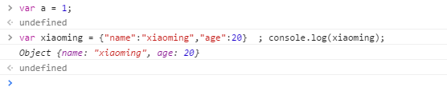
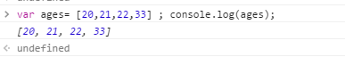

# js的数据类型——Bozai

# 
## 简单数据类型（值类型）
+ 字符串 string   
  凡是用双引号或者单引号引起的都是字符串。
var  name = ‘张三’;
var name2 = “李四李四李四李四李四李四李四李四李四李四李四李四李四李四李四李四李四李四李四”
+ 数字 number   
 包含正数  负数  小数
 var num = 1
+ 布尔值 Boolean
 只有2个值一个是true, 一个是false.   实际运算中true=1,false=0
+ 未定义 undefined
 定义了变量，没有给变量赋值 变量未初始化。
 只有一个值，即特殊的undefined。使用var声明变量但未对其加以初始化。
+ 空 null
变量未引用  值为空
 是第二个只有一个值的数据类型，这个特殊的值是null。null表示一个空对象指针，使用typeof检测null会返回'object'，如果定义的变量准备着将来用于保存对象，那么应当将变量初始化为nulll而不是其他值。
 ## 复杂数据类型
  object  对象
    

  array  数组
  

## 使用js输出
+ ⦁	alert()  在页面弹出一个对话框，早期JS调试使用。
+ ⦁	console.log()  将信息输入到控制台，用于js调试
+ ⦁	document.write()在页面输出消息    几乎不用

