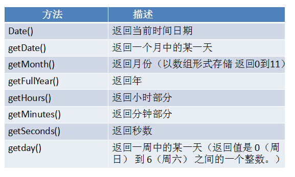

# 内置对象方法
## 数组内置对象与方法.
+ concat 数组连接。

```
var a1 = [1,2,3];
var a2 = ['a','b','v'];
var a3 = a1.concat(a2);
console.log(a3) //[1,2,3,'a','b','v'];
```

+ join 数组转化为字符串。

```
var a1 = [1,2,3]
var a2 = a1.join('.')//以点来分割。
console.log(a2)//'1'.'2'.'3';
```

+　pop 删除并返回最后一个元素。影响原来的数组

```
var a1 = ['a','c','w'];
var a2 = a1.pop();
console.log(a2) //'w'
console.log(a2)// 原数组改变为['a','c']

```

+ shift 删除并返回第一个元素。影响原来的数组

```
var a1 = ['cc','c','d];
var a2 - a1.shift()
console.log(a1) //原数组改编为['c','d']
console.log(a2)//'cc'
```

+ push 向数组后面追加一个或者多个元素。影响原来的数组

```
var a1 = [2,6,'w'];
a1.push('ww','cc');
console.log(a1)//[2,6,'w','ww','cc']
```

+ unshift 向数组前面添加一个或多个元素。影响原来的数组。

```
var　a1 = ['c','ccc','ddd']
a1.unshift('aaa',1)
console.log(a1)//['c','ccc','ddd','aaa',1]
```

+ reverse 颠倒数组。影响原数组

```
var a1 = [1,2,3,4]
a1.reverse()
console.log(a1)//[4,3,2,1]
```

+ sort 排序。升序。影响原数组//注意如果是对数组排序需要函数

```
var a1 = [1,3,2,4,7,6]
a1.sort(functtion(a,b){
	reutrn a-b
})
console.log(a1)//[1,2,3,4,6,7]
```

+ slice 可以接受两个数，第一个数必须，从哪里开始选中，可以写负数，就是倒数第几个，第二个参数可选，规定从何处结束选取。该参数是数组片断结束处的数组下标。如果没有指定该参数，那么切分的数组包含从 start 到数组结束的所有元素。如果这个参数是负数，那么它规定的是从数组尾部开始算起的元素。并不会影响原来的数组。

```
var a1 = [1,2,34,5,'a','c','v']
var a2 = a1.slice(2,5)
console.log(a1)//不变
console.log(a2) // [34,5,'a']
```

+ splice 可以接受三个参数、第一个参数代表删除的下标，第二个是删除的数量，第三个是替换的元素。第三个是可选，前两个是必须。他和slice不同的是他可以改变原来的数组！！

```
var a1 = [1,'a','c',3,4];
a1.splice(1,3)
console.log(a1)//[1,4]
```

+ indexOf 索引。

```
var a1 = [1,2,3,'a'];
console.log(a1.indexOf('b'))//-1 因为没有这个元素。
console.log(a1.indexOf(1))//0 返回1的下表。
```

+ length 返回长度。、//字符串也有这个方法。

```
var a1 = [1,2,3]
console.log(a1.length)//3
var b1 = ['o','c',1]
b1.length = 0;
console.log(b1)//返回空数组。因为b1的长度被清空。在js中lenth是可以被改变的。
```

## 字符串的内置方法。
+ concat 字符串拼接

```
var a1 = 'hello';
var a2 = ' world';
var a3 = a1.concat(a2);
console.log(a3)//'hello world';
//也可以使用'+'进行拼接。
var b1 = 'hello'
var b2 = ' world';
var b3 = b1 +　b2;
console.log(b3)//'hello world'
```

+ split 字符串转化为字符串数组。如果括号里不写参数，那么会用','隔开。如果写参数，那么那么如果这个参数在字符串中存在，会把这个字符替换为','。如果参数在字符串里不存在，那么返回原来的字符串数组。原字符串不变。

```
var a1 = 'hello world'
var a11 = a1.split('')
console.log(a11)// ["h", "e", "l", "l", "o", " ", "w", "o", "r", "l", "d"]
var a2 = 'dog';
var a22 = a2.split(',')
console.log(a22)//字符串中不存在','那么返回['dog']
var a3 = 'heihei'
var a33 = a3.split('h');
console.log(a33)//字符串中存在'h'，那么返回["", "ei", "ei"]
```

+ slice 字符串截取。第一个参数代表开始位置,第二个参数代表结束位置的下一个位置,截取出来的字符串的长度为第二个参数与第一个参数之间的差;若参数值为负数,则将该值加上字符串长度后转为正值;若第一个参数等于大于第二个参数,则返回空字符串.原字符串不变.

```
var a1 = 'hello world'
var a2 = a1.slice(2,3)
console.log(a2)//返回的就是'l'
```

+ substr 字符串截取。第一个参数是从哪里开始.第二个是截取几个。注意不建议使用这个方法，ECMAscript 没有对该方法进行标准化，因此反对使用它。

```
var a1 = 'hello world'
var a2 = a2.substr(4,1)
console.log(a2)//返回的就是'o'
```

+ substring 字符串截取 第一个参数代表开始位置,第二个参数代表结束位置的下一个位置;若参数值为负数,则将该值转为0;两个参数中,取较小值作为开始位置,截取出来的字符串的长度为较大值与较小值之间的差.原字符串不变。

```
var a1 = 'iMissYou'
var a2 = a1.substring(2,3)
console.log(a2) //返回的是'i'
var a11 = 'iMissYou'
var a22 = a11.substring(3,2)
console.log(a22)//返回的还是'i' 因为取最小的作为开始位置。
```


+ trim() 创建一个字符串副本,去除前置或后缀的所有空格.中间的不删除.
trimLeft/trimRight
```
var stringV = '  hello    '
console.log(stringV.trim())//'hello'

```

+ charAt()返回在指定位置的字符。原字符串不变
```
var a1 = 'hello'
var a2 = a1.charAt(0)
console.log(a1)//不变
console.log(a2)//返回的是h.
```

+ indexOf() 检索。区分大小写 只返回第一次出现的位置。
 
```
var a1 = 'MissYou'
console.log(a1.indexOf(1)) //返回-1 因为不包含1.
console.log(a1.indexOf('M')) //返回0.M的下表
```

+ lastIndexOf() 从后面检索。返回最后一次出现的位置

```
var a1 = 'MissYou'
console.log(a1.lastIndexOf('s'))//返回的是s最后一次出现下表3.

```

+ toLocaleLowerCase() 转换为小写。原字符串不变。

```
var a1 = 'MissYou'
var a2 = a1.toLocaleLowerCase()
console.log(a2) //'missyou'
```

+ toLocaleUpperCase() 转换为大写。（同上）
+ replace()//使用字符串或者正则匹配替换。 原字符串不变。

```
var a = 'MissYou'
var b = a.replace('M','a')
console.log(b)//aissYou
```

## Date对象方法

## Math对象的属性。
+ Math.abs()返回数的绝对值。
+ Math.ceil()向上舍入。天花板函数
+ Math.floor()向下舍入。地板函数
+ Math.max(x,y)返回xy中的最大值。
+ Math.min(x,y)返回xy中的最小值。
+ Math.pow(x,y)返回x的y次幂。
+ Math.random()返回0-1之间的随机数。（可以搭配Math.floor（））
+ Math.round(x)把数四舍五入为最接近的整数。