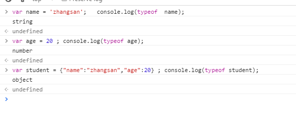

# 运算符

# 运算符
### 判断数据类型(typeof)

### 比较运算符
<  >   <=  >=   ==  != ===
+ **注意** 一个“=”是赋值 两个“==”才是比较运算符
+ ==和===
  

等于 == 先转换在比较
  

全等于 === 不转换 仅比较、
### 算术运算符
+ +加号
    两个数字类型的变量相加，得到的是一个数字类型。  

    一个数字类型和一个字符串相加，得到的是一个字符串(拼接)。
+ -减号
  两个数字类型的变量相减，得到的是一个数字类型。  

    一个数字类型和一个数字字符串相减，得到的是一个数字类型。（数据类型隐式转换）

    一个数字类型和一个非数字字符串相减，得到的是NaN,是一个数字类型。

    NaN用于引用特殊的非数字值。

    a) NaN 非数值（Not a Number的简写）

    console.log(“abc”/18);  //结果是NaN

    Undefined和任何数值计算为NaN;

    NaN 与任何值都不相等，包括 NaN 本身  

    b) isNaN() :任何不能被转换为数值的值都会导致这个函数返回 true 
    （isNaN译为是否符合一个标准，什么标准呢？不是一个数字的标   准，如果符合了那么就不是一个数字，不符合就是一个数字）

    isNaN(NaN);// true

    isNaN(“blue”); // true

    isNaN(123); // false

+ / 除号
 两个数字类型的变量相除，得到的是一个数字类型。
 一个数字类型和一个数字字符串相除，得到的是一个数字类型。
 一个数字类型和一个非数字字符串相除，得到的是NaN,是一个数字类型。
 0做为除数的时候，得到结果  Infinity （无限大），是一个数字类型。
+ %  取余数
### 布尔操作符。
逻辑非 ！ 不等于
  

逻辑与 && 必须条件都一样
  

逻辑或 || 条件有一个是对的就是true
  
NaN和NaN不想等
  

null 和 undefined是相等的。
  
  
