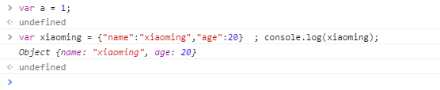

# js的数据类型——Bozai

# 
## 简单数据类型（值类型）
+ 字符串 string   
  凡是用双引号或者单引号引起的都是字符串。
var  name = ‘张三’;
var name2 = “李四李四李四李四李四李四李四李四李四李四李四李四李四李四李四李四李四李四李四”
+ 数字 number   
 包含正数  负数  小数
 var num = 1
+ 布尔值 Boolean
 只有2个值一个是true, 一个是false.   实际运算中true=1,false=0
+ 未定义 undefined
 定义了变量，没有给变量赋值 变量未初始化。
 只有一个值，即特殊的undefined。使用var声明变量但未对其加以初始化。
+ 空 null
变量未引用  值为空
 是第二个只有一个值的数据类型，这个特殊的值是null。null表示一个空对象指针，使用typeof检测null会返回'object'，如果定义的变量准备着将来用于保存对象，那么应当将变量初始化为nulll而不是其他值。
 ## 复杂数据类型
  object  对象
    


  array  数组
  

  ### 遍历数组.

```
var arr = [1,2,3,4]
for(var i = 0 ; i < arr.length ; i++){
  console.log(arr[i])//会依次打印arr数组中的内容。
}
```

#### 函数的定义与调用.
+ 首先什么是函数？为什么使用函数。
函数就是可以重复执行的代码块。
为了完成特定功能
  
  因为一部分代码使用次数可能会很多，所以封装起来，需要的时候调用就可以了。
以后任何时候写代码，首先考虑，有没有什么功能是需要封装的，再一个有没有什么功能是以前封装好的。
面向对象编程是一种编程思想。特点：封装、继承、多态。
+　参数
　参与运算的变量。
为了增强函数的功能性，和程序员的交互性，和函数的可拓展行。
参数里面有 **形参** 和 **实参**  
形参就是形式上参与运算的变量，无实际值，为实参占位置。（可以理解为函数的内部变量外部无法访问），类似与先假设一下有他存在。
实参呢就是调用函数时候传进去的值。实际参与运算的变量。形参为他占位置，真实参与运算的变量


